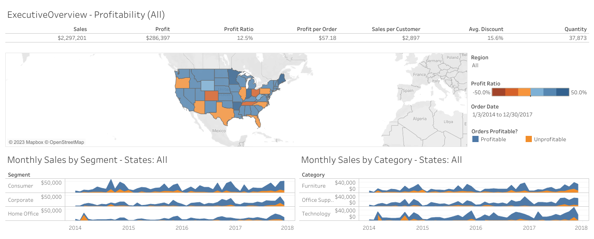

# My Tableau Project - Interactive Dashboard Creation

I'm excited to share my completed Tableau Project - Interactive Dashboard Creation. Throughout this project, I delved into foundational Tableau concepts and terminology while building an interactive dashboard in Tableau Public. I followed along using the Sample - Superstore Excel data set. Here's a summary of my journey:

- [Tableau Sales Dashboard](https://public.tableau.com/shared/HKMZS4GHR?:display_count=n&:origin=viz_share_link)

## Project Overview

In this project, I learned how to create interactive dashboards in Tableau. I explored key concepts and techniques to build engaging visualizations. Here are the main topics I covered, along with the respective video durations:

### 1. Get Started 
   - I learned foundational Tableau concepts and terminology.
   - I built an interactive dashboard using the Sample - Superstore Excel data set.

### 2. Connect to Data 
   - I explored how to connect to data sources.
   - I learned how to relate multiple tables to create a Tableau data source.
   - I followed along using the Sample - Superstore Excel data set.

### 3. Navigate the Workspace Area 
   - I familiarized myself with the layout of the Tableau workspace.
   - I gained an understanding of the high-level dashboard creation process.

### 4. Map: Profit Ratio by Geography 
   - I learned how to create and format a map visualization in Tableau.

### 5. Area Charts: Sales by Category and Sales by Segment 
   - I explored fundamental Tableau concepts while creating two area charts to visualize sales data.

### 6. Text Table: Key Performance Indicators 
   - I discovered how to quickly create a text table using the measure names and measure values fields.

### 7. Bar Chart: Profit Ratio by City
   - I learned how to create a bar chart that appears when hovering over the map.

### 8. Build a Dashboard
   - I combined views and applied actions to create a fully interactive dashboard.

## My Experience

Throughout this project, I actively engaged with Tableau to understand its capabilities and functionalities. I followed the tutorials in each section and experimented with the provided data to create my interactive dashboards. By the end of the project, I gained valuable skills and knowledge in Tableau, enabling me to create my own interactive visualizations and dashboards.

## Get Started!

If you're looking to learn Tableau and create your interactive data visualizations, I highly recommend following the steps and tutorials I've completed in this project. Dive in, explore, and enjoy your Tableau journey!
